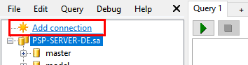
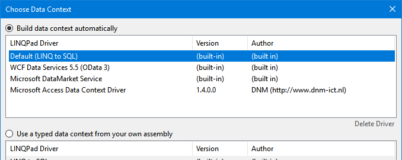
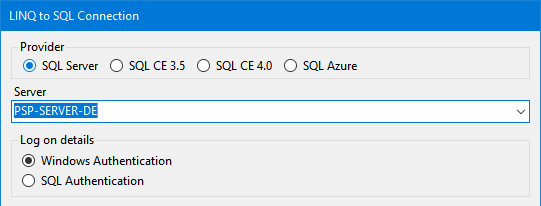
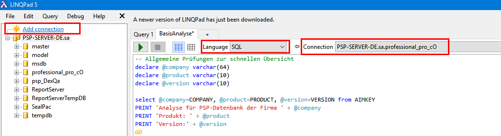

# psp-linqpad-scripts

## Disclaimer

THE SAMPLE CODE ON THIS REPOSITORY IS PROVIDED "AS IS" WITHOUT WARRANTY OF ANY KIND, EITHER EXPRESSED OR IMPLIED, INCLUDING, BUT NOT LIMITED TO, THE IMPLIED WARRANTIES OF MERCHANTABILITY, FITNESS FOR A PARTICULAR PURPOSE, OR NON-INFRINGEMENT.

THE USAGE OF THIS SAMPLE IS AT YOUR OWN RISK AND **THERE IS NO SUPPORT** RELATED TO IT.

## Description

LINQPad-scripts for analysis of the PSP database:
- BaseAnalysis_UK.linq: General SQL analysis with english report
- BasisAnalyse_DE.linq: General SQL analysis with german report
- DocumentRevisionCheck.linq: C#-script to check whether documents have a date conflict
- ItemRevisionCheck.linq: C#-script to check whether items have a date conflict

Download LINQPad 5 and install it on a PSP-Client machine. 

The scripts can be extracted in any folder.
- These can be opened with LINQPad. 
- With „Add connection“ the connection to the database must be established.
    
    - There choose ‘Default (LINQ to SQL)’ and then „Next >“

    - In the following dialog the server must be specified:

•	Script BasisAnalyse.linq gives an overview of the database. „Language“ must be set to „SQL“, as it is an SQL-script.

For scripts DocumentRevisionCheck.linq and ItemRevisionCheck.linq „Language“ must be set to „C# Program“, as they are C#-scripts.

When the analysis is done, there is an export into Excel and Word in the result bar. Take the export you prefer.

These scripts are made to help you in your projects. But there is no guarantee on correctness and completeness. 

## Author
coolOrange s.r.l.  
Channel Readiness Team

